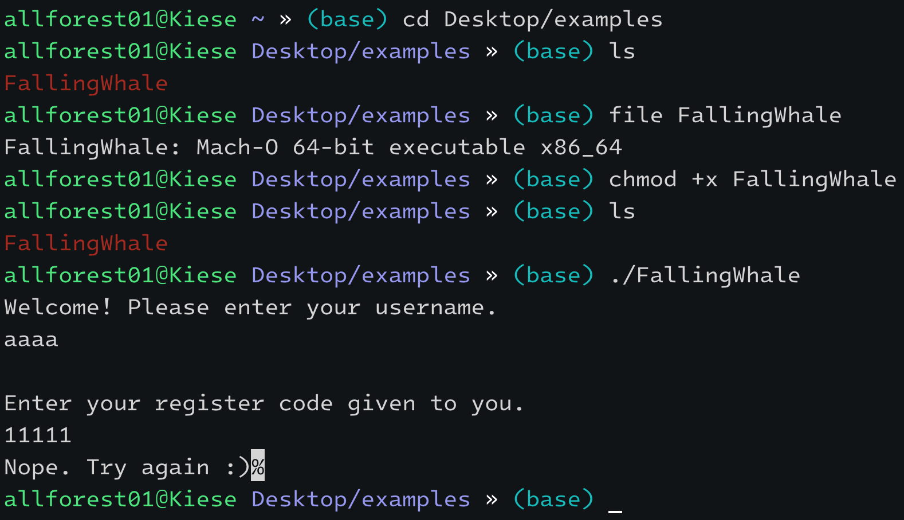
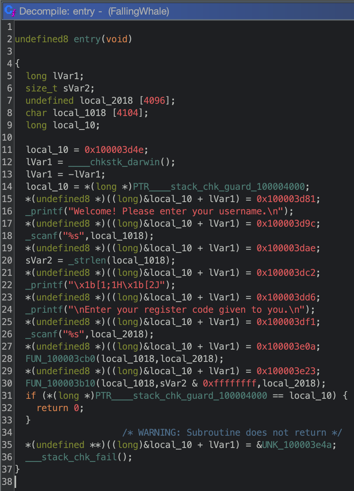
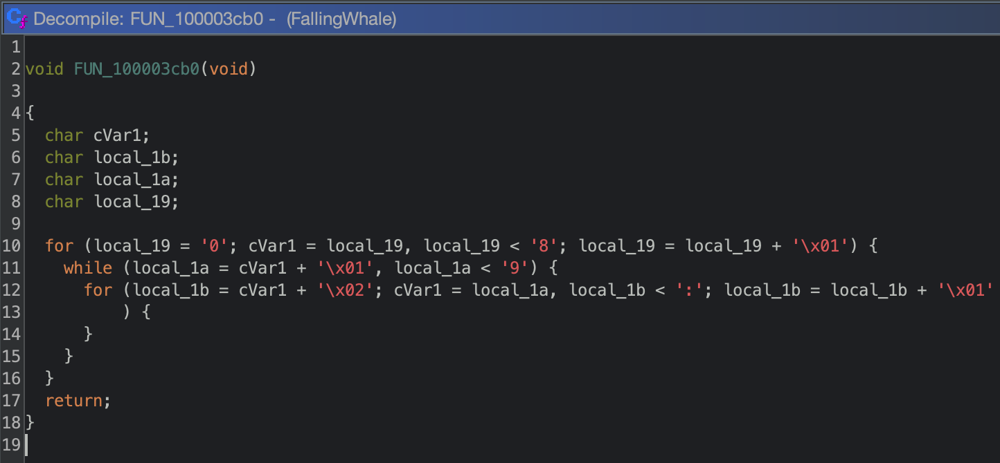
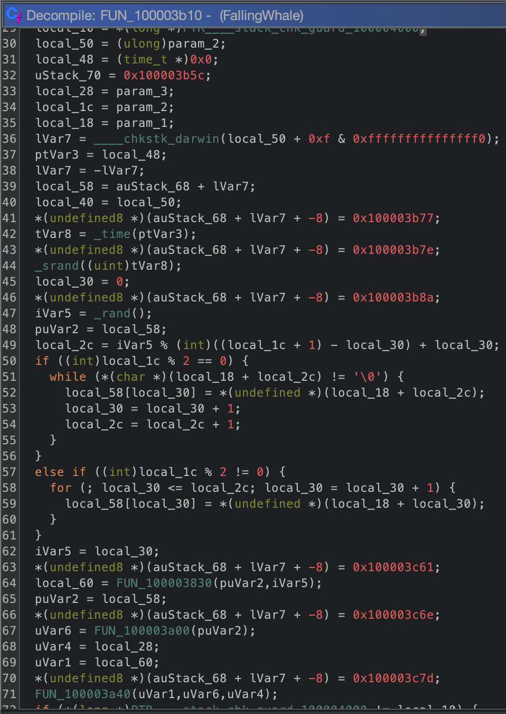
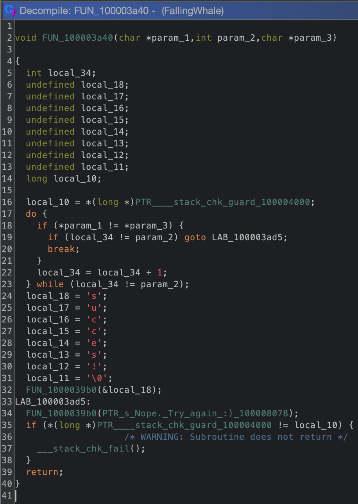
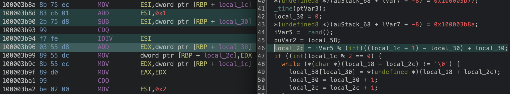
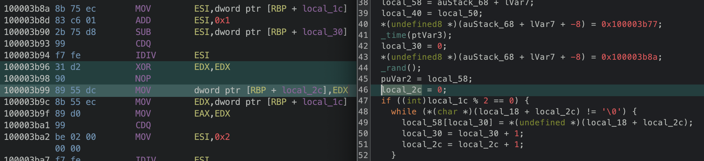
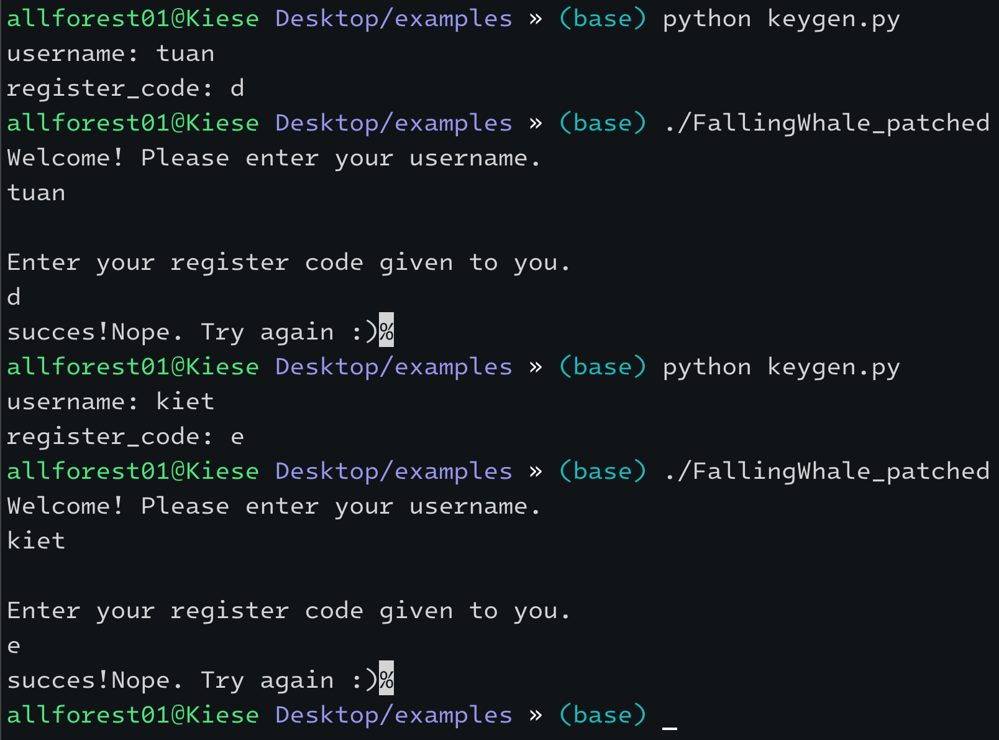

# How I reversing on M1


<!--more-->


I've have a hard time using Macbook M1 to learn about reversing.
Because M1 is ARM chip and I can't find an easy way to dynamic analyst an ELF file.
So today I will share my exprience about reversing on M1.
For each program type, I will solve one crackme step by step as an example.


## MacOS

### x86-64


Crackme: https://crackmes.one/crackme/60d3982833c5d410b8842fa5


I use zsh and ohmyzsh for main terminal, the reason i use it is because it's so beautiful.



For static analyst, I will use `Ghidra`. You can install `Ghidra` through `Homebrew`.


If you like dark theme, you can install it through here:  
https://github.com/zackelia/ghidra-dark-theme


Let's run `Ghidra` by `ghidraRun` command and start analyst this crackme.

Decompile at the entry:



We can easily see that the program read username and register code, then pass to FUN_100003cb0 to do something. So let's go to the `FUN_100003cb0`:



The `FUN_100003cb0` is not do anything important so just go back and go to `FUN_100003b10`:



The decompile is so terrible so i will go to the end and traceback from the end:



From the `line 24` to the `line 34`, we know that `FUN_1000039b0` is a print function. `line 32` will be executed and print out `"succes!"` only if the password is true. And `line 34` will allways be executed and print out `"Nope. Try again :)"`.

From the `line 17` to the `line 23`, we see that `param_1`, `param_3` look like the string, and `param_2` is the lenght.
We see that `param_1` and `param_3` is compared for only first digit.

Back to `FUN_100003b10`, I will remove the lines relative to StackGuard, because it's doesn't needed for understanding what the program doing here.


You can read about StackGuard here:  
https://www.redhat.com/en/blog/security-technologies-stack-smashing-protection-stackguard


I also rewrite the code as pseudo-code to make it more clearly and understanding.


You should copy and paste code to the ide like vscode, which can highlight everywhere the varible appear when you select any varible, so it's easy to rewrite the code.


```cpp
srand(time(NULL));
local_pos = 0;
username_pos = rand() % (username_len + 1);
if (username_len % 2 == 0) {
  while (username[username_pos] != '\0') {
    local_str[local_pos] = username[username_pos];
    local_pos++;
    username_pos++;
  }
}
else if (username_len % 2 != 0) {
  for (; local_pos <= username_pos; local_pos++) {
    local_str[local_pos] = username[local_pos];
  }
}
compare(md5(local_str, local_pos), strlen(local_str), register_code);
```

For unknown `rand()` value, we cant generate register code like this:

```python
import hashlib

username = input('username: ')
username_len = len(username)

for split_pos in range(username_len + 1):
    if username_len % 2 == 0:
        local_str = username[split_pos:]
        register_code = hashlib.md5(local_str.encode()).hexdigest().upper()
        register_code_len = username_len - split_pos
    else:
        local_str = username[:split_pos]
        register_code = hashlib.md5(local_str.encode()).hexdigest().upper()
        register_code_len = split_pos
    print(register_code[:register_code_len])
```

Only one register code in generated codes is valid. The crackme is so bad because the valid register code is generate randomly after our register code is inputed. That cant be happend in reality scenario. So we need to patch this crackme to fix this problem.

I will fixed the value `local_2c` to `0` by patch the line 46 from this:



to this (XOR EDX it self to make it equal 0):




To save the patched, following the tutorial:  
https://materials.rangeforce.com/tutorial/2020/04/12/Patching-Binaries/


So we can rewrite the resigter code generatation like this:

```python
import hashlib

username = input('username: ')
username_len = len(username)

split_pos = 0
if username_len % 2 == 0:
    local_str = username[split_pos:]
    register_code = hashlib.md5(local_str.encode()).hexdigest()
else:
    local_str = username[:split_pos + 1]
    register_code = hashlib.md5(local_str.encode()).hexdigest()
print('register_code: ' + register_code[:1])
```

Okay we will test it:



[This posts is currently being updated...]

